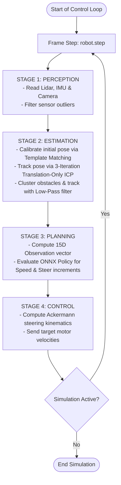

<p align="center">
  
</p>

# WRO Future Engineers - RL Autonomous Racing Simulation

[](https://www.python.org)
[](https://gymnasium.farama.org/)
[](https://cyberbotics.com/)
[](https://onnxruntime.ai/)

An autonomous racing robot for the **WRO (World Robot Olympiad) Future Engineers** competition, trained using **Deep Reinforcement Learning (PPO)** in a custom **Webots simulation**. The control pipeline features real-time **ICP-based localization** and **dynamic obstacle mapping** with ray-cast decay.

<p align="center">
  
  
</p>

---

## 💡 Motivation & Background

In the 11th grade, I participated in the **WRO Future Engineers** competition, winning **1st place in the Regional and German National Finals**, and **13th in the World Finals** (see our old hardware-based robot: [wro-fe-MacRobot](https://github.com/Bigfire3/wro-fe-MacRobot)). At the time, we used a classical, model-based reflex agent with limited decision-making intelligence.

Now, as a **6th-semester Robotics student**, I wanted to revisit this challenge using **Deep Reinforcement Learning (RL)** and high-fidelity simulator testing. This repository represents a complete redesign of the project from scratch.

---

## 🛠️ Software Architecture

The control loop is executed sequentially in a **4-Stage Software Pipeline** at every simulation step:



Detailed documentation of coordinate transforms, localization mathematics, and mapping algorithms can be found in [docs/architecture.md](file:///c:/Users/fabia/Documents/WRO_FE_SIM/docs/architecture.md).

---

## ✨ Key Technical Highlights

*   **Curriculum Reinforcement Learning:** Trained using **PPO (Stable-Baselines3)** on a custom **Gymnasium** environment. The agent transitions from **Stage 1 (Safety focus)**, which teaches lane-keeping and basic driving at a constant speed, to **Stage 2 (Performance focus)**, optimizing lap times with variable speed control and curve-cutting.
*   **Translation-Only ICP:** Scan-to-map matching via a fast 3-iteration Iterative Closest Point algorithm to maintain an accurate estimate of the robot's local pose `(x, y, yaw)`.
*   **Dynamic Obstacle Mapping:** Clusters LiDAR outliers (representing the obstacle boxes) and filters them dynamically. Implements a ray-casting visibility decay method to fade out obstacles once they are no longer in the vehicle's line-of-sight.
*   **Path Coloration Visualizer:** Draws a live trajectory path colored based on current velocity (from slow cyan/blue to fast orange/red) with an on-screen velocity legend.

---

## 📂 Project Directory Structure

*   [controllers/wro_driver/](file:///c:/Users/fabia/Documents/WRO_FE_SIM/controllers/wro_driver/): Core autonomy software.
    *   `wro_gym_env.py`: Gymnasium reinforcement learning environment wrapper.
    *   `train.py`: Training script for PPO with curriculum stage support.
    *   `export_onnx.py`: Utility script to export trained Stable-Baselines3 policies to ONNX.
    *   `wro_driver.py`: Webots supervisor node executing the ONNX model inference.
    *   `wro_core/`: Auxiliary estimation, perception, planning, and control modules.
*   [docs/](file:///c:/Users/fabia/Documents/WRO_FE_SIM/docs/): Technical documentation and visual assets.
*   [models/](file:///c:/Users/fabia/Documents/WRO_FE_SIM/models/): Exported ONNX model configurations (`wro_model.onnx`).
*   [worlds/](file:///c:/Users/fabia/Documents/WRO_FE_SIM/worlds/): Simulation arenas (`track.wbt` for testing, `track_training.wbt` for training).

---

## 🚀 Getting Started

### 1. Prerequisites
Make sure you have [Webots](https://cyberbotics.com/) installed (tested with Webots R2025b).

### 2. Setup Virtual Environment
```bash
git clone https://github.com/Bigfire3/wro-fe-rl-simulation.git
cd wro-fe-rl-simulation
python -m venv .venv
.venv\Scripts\activate
pip install -r requirements.txt
```

### 3. Training the Agent
```bash
python controllers/wro_driver/train.py --timesteps 150000 --no-render
tensorboard --logdir=tb_logs
```

### 4. Running Simulation & Inference
Open the world file `worlds/track.wbt` in Webots and press the **Play** button. The controller node will start automatically and read `models/wro_model.onnx` to drive.