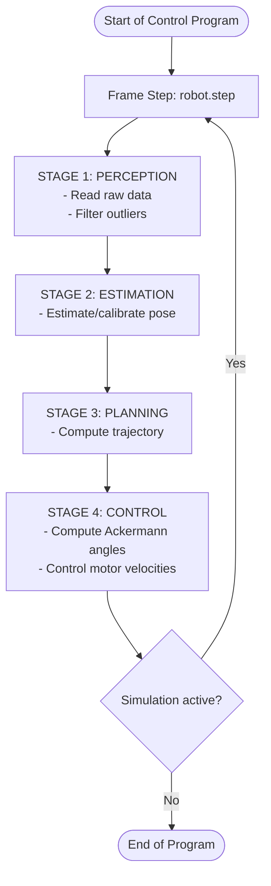

# `wro_core` - Embedded Software Architecture

This directory contains the modular library components that form the foundational helper modules for **Stage 1 (Perception)**, **Stage 2 (Estimation)**, and **Stage 4 (Control)** of the autonomous software architecture.

---

## 1. The 4-Stage Software Pipeline

To ensure a clean separation of concerns and adhere to best practices in embedded software development, the robot's control loop MUST be executed sequentially across 4 clearly defined stages in every simulation frame.

Planning logic is entirely encapsulated in **STAGE 3: PLANNING**. Stages 1, 2, and 4 do not contain planning decisions (though Stage 2 handles the one-time calibration for pose and heading estimation at startup).

* **[ STAGE 1: PERCEPTION ]** (Perception)
  * *Responsibility:* Reading raw sensor data (LiDAR distances, IMU values, camera images) and applying basic filtering (e.g., outlier removal).
  * *Constraint:* Contains no state checks, wait times, or control flow logic (no state machine logic).

* **[ STAGE 2: ESTIMATION ]** (State Estimation)
  * *Responsibility:* Estimating the robot's pose `(x, y, yaw)` via geometric matching (Template Matching for initial calibration, Translation-Only ICP for continuous tracking). Classifies LiDAR outliers and performs dynamic obstacle mapping.

* **[ STAGE 3: PLANNING ]** (Path Planning)
  * *Responsibility:* Computing the target trajectory (target speed and steering angles) using reinforcement learning inference.

* **[ STAGE 4: CONTROL ]** (Control & Actuation)
  * *Responsibility:* Computing actuator control variables (Ackermann steering geometry for steering servos, target motor velocities for driving motors) based on specifications from Stage 3.
  * *Features:*
    * **Direct Control**: No low-pass filtering on commands for maximum responsiveness.
  * *Constraint:* Operates independently of internal robot state; only performs mathematical control calculations and safety clamping.

---

## 2. Coordinate System and Visualization Space Specifications

The codebase uses a strictly positive global coordinate system for positioning and orientation in the arena.

* **Continuous Real Space ($P_r$):**
  * Origin $(0.0, 0.0)$ is located exactly at the **south-west inner corner** of the outer boundary.
  * X-axis: $0.0\,\text{m}$ to $3.0\,\text{m}$ (West to East / Easting).
  * Y-axis: $0.0\,\text{m}$ to $3.0\,\text{m}$ (South to North / Northing).
  * Orientation (Yaw): $0.0\,\text{rad}$ points North (+Y). Positive angles rotate counter-clockwise (CCW).
* **OpenCV Visualization Space ($P_{cv}$):**
  * An image window of size $600 \times 600$ pixels displaying LiDAR scans from the robot's local perspective.
  * The robot is centered in the image at $(cx, cy) = (300, 300)$.
  * Scaling is $150\,\text{pixels/meter}$ (`scale = 150.0`).
  * Transformation for LiDAR points:
    * `px = cx - y_local * scale`
    * `py = cy - x_local * scale`
    (Since the robot's local X-axis points forward and local Y-axis points left).
* **Template Matching / Calibration Space ($P_{tpl}$):**
  * The reference map of the arena is drawn on an image sized by the search region with added padding: `img_size = int((3.0 + 2.0 * padding) * scale)` pixels (with `scale = 150.0` and `padding = 2.0`, this equals $1050 \times 1050$ pixels).
  * Translation of a global position $(x, y)$ to pixel coordinates on this map:
    * `px = int((x + padding) * scale)`
    * `py = int(img_size - (y + padding) * scale)` (Y-axis inverted).

---

## 3. Module Specification: Estimation & Mapping (Stage 2)

### 3.1. OpenCV Template Matching
*   **File:** [opencv_localizer.py](opencv_localizer.py)
*   **Key Function:** `calibrate_initial_pose(avg_ranges, angle_offset, angle_inc)`
*   **Description:** Estimates the initial pose in the start corridor using template matching and determines the driving direction (`CW` or `CCW`).

### 3.2. Translation-Only ICP
*   **File:** [trans_icp_localizer.py](trans_icp_localizer.py)
*   **Key Function:** `update(lidar_ranges, imu_yaw, max_range=2.0, ego_v_x=0.0)`
*   **Description:** Calculates the pose `(x, y, yaw)` using a 3-iteration translation-only ICP and returns LiDAR outliers (distance from wall $\ge 15\,\text{cm}$). Records the driven trajectory.
*   **Rendering:** `render()` produces a debug image showing LiDAR points (inliers in green, outliers in red) and the robot pose. The trajectory path is **colored dynamically based on velocity** (from cyan/blue for slow, to green, and orange/red for maximum speeds up to 1.6 m/s) with a color scale legend.

### 3.3. Dynamic Obstacle Mapping
*   **File:** [obstacle_mapper.py](obstacle_mapper.py)
*   **Key Function:** `update(robot_pose, outlier_points)`
*   **Description:** Clusters outliers (threshold $10\,\text{cm}$, noise filter $\ge 2$ points), associates them with obstacles ($50\,\text{mm}$ boxes), and updates their position (using a low-pass filter with $\alpha = 0.1$) and confidence (+0.01). Decreases confidence (-0.01) if not detected, but only within the free line of sight (radius $< 2.0\,\text{m}$, line-of-sight not blocked by walls or other obstacles).
*   **Rendering:** `render(img, robot_pose, scale, window_size)` draws obstacles (color represents classified color red/green, or grayscale based on confidence) and green line-of-sight rays to the robot.

---

## 4. Actuator Control (Stage 4)

*   **File:** [control.py](control.py)
*   **Key Class:** `Controller`
*   **Description:** Operates independently of internal robot state; only performs mathematical control calculations and safety clamping.
    *   **Ackermann Kinematics:** Transforms target speed and steering angle into individual angles for the left and right steering knuckles.
    *   **Direct Control Loop:** Avoids steering low-pass filtering to allow maximum responsiveness during high-frequency RL correction commands.
