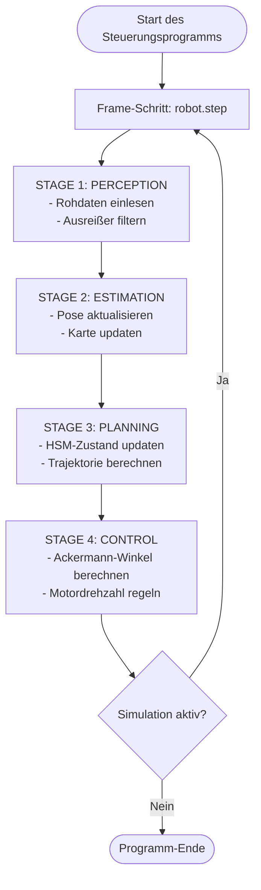

# WRO Future Engineers 2026 - Eingebettete Softwarearchitektur

## 1. Die 4-Stufen-Software-Pipeline

Um eine saubere Code-Trennung zu gewährleisten und Best Practices der Embedded-Software-Entwicklung einzuhalten, MUSS die Regelschleife des Roboters in jedem Frame sequenziell über 4 klar abgegrenzte Stufen ausgeführt werden. 

Die Zustandslogik (State Machine) ist dabei vollständig in **STAGE 3: PLANNING** gekapselt. Die Stufen 1 und 4 verarbeiten Daten zustandsunabhängig.

* **[ STAGE 1: PERCEPTION ]** (Wahrnehmung)
  * *Verantwortung:* Einlesen der Rohdaten von den Sensoren (LiDAR-Distanzen, IMU-Werte, Kamerabild) und Anwendung grundlegender Filter (z. B. zur Entfernung von Ausreißern).
  * *Einschränkung:* Diese Stufe enthält **keine** Zustandsprüfungen, Wartezeiten oder Kontrollflusssteuerungen (keine State-Machine-Logik).
  
* **[ STAGE 2: ESTIMATION ]** (Zustandsschätzung)
  * *Verantwortung:* Berechnung der Roboterpose `(x, y, yaw)` durch geometrischen Abgleich (z. B. Scan-Matching auf der Karte) und Aktualisierung des diskreten Belegungsgitters (Occupancy Grid). Führt beim Start die einmalige Initial-Lokalisierung (Kalibrierung) durch, um Anfangspose und Fahrtrichtung (CW/CCW) zu bestimmen.
  
* **[ STAGE 3: PLANNING ]** (Pfadplanung & State Machine)
  * *Verantwortung:* Ausführung der übergeordneten hierarchischen State Machine (HSM), d.h. Steuerung des System-Lebenszyklus (`STOP` -> `RUNNING` -> `COMPLETED`/`ERROR`) und der Fahr-Verhaltensweisen sowie Generierung der Soll-Trajektorie (Geschwindigkeits- und Lenkwinkelvorgaben).
  * *Einschränkung:* Dies ist der **einzige** Ort, an dem Zustandsübergänge und verhaltenssteuernde Entscheidungen getroffen werden.
  
* **[ STAGE 4: CONTROL ]** (Regelung)
  * *Verantwortung:* Berechnung der konkreten Stellgrößen für die Aktuatoren (Ackermann-Lenkgeometrie für die Servomotoren, PID-Regler für die Radgeschwindigkeiten) basierend auf den Vorgaben aus Stage 3.
  * *Einschränkung:* Diese Stufe arbeitet rein zustandsunabhängig und führt lediglich mathematische Regelungsberechnungen und Sicherheitsbegrenzungen (Clamping) durch.

---

## 2. Spezifikationen des Koordinatensystems

Die Codebasis verwendet ein strikt positives Koordinatensystem, um mathematische Formeln direkt auf Gitterindizes abzubilden und Fehler durch negative Array-Indexierungen zu vermeiden.

* **Realer kontinuierlicher Raum ($P_r$):**
  * Der Ursprung $(0.0, 0.0)$ befindet sich exakt in der **südwestlichen Innenecke** der Außenbegrenzungen.
  * X-Achse: $0.0\,\text{m}$ bis $3.0\,\text{m}$ (Westen nach Osten).
  * Y-Achse: $0.0\,\text{m}$ bis $3.0\,\text{m}$ (Süden nach Norden).
* **Diskreter Belegungsgitter-Raum ($P_v$):**
  * Ein statisches 2D-`numpy`-Array mit $60 \times 60$ Matrixeinträgen.
  * Auflösung: $1 \text{ Zelle} = 5\,\text{cm} \times 5\,\text{cm}$ ($0.05\,\text{m}$).
  * Konvertierung: `cell_x = int(x_real * 20)`, `cell_y = int(y_real * 20)`.
* **OpenCV-Visualisierungsraum ($P_{cv}$):**
  * Ein natives Layout von $600 \times 600$ Pixeln, das streng auf die innere Arena zugeschnitten ist.
  * $1 \text{ Zelle} = 10 \times 10$ Pixel.
  * Konvertierung: `pixel_x = cell_x * 10 + 5`, `pixel_y = (59 - cell_y) * 10 + 5` (Y-Achse für Matrix-Rendering invertiert).

---

## 3. Modulspezifikation: `OpenCVLocalizer` (`opencv_localizer.py`)

Das Schätzmodul (Estimation) ist vollständig eigenständig und austauschbar. Es stellt eine strikte, standardisierte Funktionssignatur bereit, damit es später sauber gegen alternative Algorithmen (z. B. Partikelfilter) ausgetauscht werden kann.

### 3.1. Standardschnittstelle der Klasse
* **Initialisierung:** `__init__(self)`
* **Pipeline-Einstiegspunkt:** `def update(self, lidar_ranges, max_range=2.0, angle_offset=-math.pi)`
  * *Rückgabe:* `(float x_real, float y_real, float yaw_real)`

---

## 4. Modulspezifikation: Planung (Hierarchische State Machine)

Die Verhaltenssteuerung des Roboters wird über eine Hierarchische State Machine (HSM) realisiert, die in **STAGE 3: PLANNING** ausgeführt wird. Sie trennt strikt den globalen System-Lebenszyklus von den eigentlichen Fahr-Zuständen.

Die vollständige Spezifikation der Zustandsmaschine, einschließlich der Hierarchie, aller Zustandsbeschreibungen (Zweck, Ein-/Ausgänge, Austrittsbedingungen), der Übergangstabelle und des Zustandsdiagramms befindet sich in der separaten Datei [state_machine.md](file:///c:/Users/fabia/Documents/WRO_FE_SIM/docs/state_machine.md).

---

## 5. Flussdiagramm: Gesamtprogrammablauf (Control Loop)

Dieses Diagramm zeigt den sequenziellen Durchlauf der 4 Stufen der Software-Pipeline in jedem Simulations-Zeitschritt:

