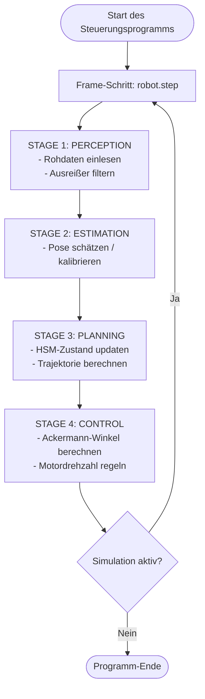

# WRO Future Engineers 2026 - Eingebettete Softwarearchitektur

## 1. Die 4-Stufen-Software-Pipeline

Um eine saubere Code-Trennung zu gewährleisten und Best Practices der Embedded-Software-Entwicklung einzuhalten, MUSS die Regelschleife des Roboters in jedem Frame sequenziell über 4 klar abgegrenzte Stufen ausgeführt werden. 

Die Zustandslogik (State Machine) ist dabei vollständig in **STAGE 3: PLANNING** gekapselt. Die Stufen 1, 2 und 4 enthalten keine State-Machine-Zustandsübergänge (wobei Stage 2 beim Start die einmalige Kalibrierung zur Pose- und Richtungsschätzung übernimmt).

* **[ STAGE 1: PERCEPTION ]** (Wahrnehmung)
  * *Verantwortung:* Einlesen der Rohdaten von den Sensoren (LiDAR-Distanzen, IMU-Werte, Kamerabild) und Anwendung grundlegender Filter (z. B. zur Entfernung von Ausreißern).
  * *Einschränkung:* Diese Stufe enthält **keine** Zustandsprüfungen, Wartezeiten oder Kontrollflusssteuerungen (keine State-Machine-Logik).
  
* **[ STAGE 2: ESTIMATION ]** (Zustandsschätzung)
  * *Verantwortung:* Berechnung der Roboterpose `(x, y, yaw)` durch geometrischen Abgleich (z. B. mittels Template-Matching gegen eine Referenz-Karte) und kontinuierliches Pose-Tracking. Führt beim Start die einmalige Initial-Lokalisierung (Kalibrierung) durch, um die genaue Anfangspose und die Fahrtrichtung (CW/CCW) im Startkorridor zu bestimmen.
  
* **[ STAGE 3: PLANNING ]** (Pfadplanung & State Machine)
  * *Verantwortung:* Ausführung der übergeordneten hierarchischen State Machine (HSM), d.h. Steuerung des System-Lebenszyklus (`STOP` -> `RUNNING` -> `COMPLETED`/`ERROR`) und der Fahr-Verhaltensweisen sowie Generierung der Soll-Trajektorie (Geschwindigkeits- und Lenkwinkelvorgaben).
  * *Einschränkung:* Dies ist der **einzige** Ort, an dem Zustandsübergänge und verhaltenssteuernde Entscheidungen getroffen werden.
  
* **[ STAGE 4: CONTROL ]** (Regelung)
  * *Verantwortung:* Berechnung der konkreten Stellgrößen für die Aktuatoren (Ackermann-Lenkgeometrie für die Servomotoren, PID-Regler für die Radgeschwindigkeiten) basierend auf den Vorgaben aus Stage 3.
  * *Einschränkung:* Diese Stufe arbeitet rein zustandsunabhängig und führt lediglich mathematische Regelungsberechnungen und Sicherheitsbegrenzungen (Clamping) durch.

---

## 2. Spezifikationen des Koordinatensystems und Visualisierungsraums

Die Codebasis verwendet ein strikt positives globales Koordinatensystem für die Positionierung und Ausrichtung in der Arena.

* **Realer kontinuierlicher Raum ($P_r$):**
  * Der Ursprung $(0.0, 0.0)$ befindet sich exakt in der **südwestlichen Innenecke** der Außenbegrenzungen.
  * X-Achse: $0.0\,\text{m}$ bis $3.0\,\text{m}$ (Westen nach Osten / Easting).
  * Y-Achse: $0.0\,\text{m}$ bis $3.0\,\text{m}$ (Süden nach Norden / Northing).
  * Orientierung (Yaw): $0.0\,\text{rad}$ zeigt nach Norden (+Y). Positive Winkel drehen im Gegenuhrzeigersinn (CCW).
* **OpenCV-Visualisierungsraum ($P_{cv}$):**
  * Ein Bildfenster der Größe $600 \times 600$ Pixel, welches die LiDAR-Messungen aus der Roboter-Perspektive darstellt.
  * Der Roboter befindet sich im Zentrum des Bildes $(cx, cy) = (300, 300)$.
  * Die Skalierung beträgt $150\,\text{Pixel/Meter}$ (`scale = 150.0`).
  * Transformation für LiDAR-Punkte:
    * `px = cx - y_local * scale`
    * `py = cy - x_local * scale`
    (Da die lokale X-Achse des Roboters nach vorne zeigt und die lokale Y-Achse nach links).
* **Template-Matching / Kalibrierungs-Raum ($P_{tpl}$):**
  * Die Referenzkarte der Arena wird auf ein Bild gezeichnet, dessen Größe durch den Suchbereich mit zusätzlichem Padding bestimmt wird: `img_size = int((3.0 + 2.0 * padding) * scale)` Pixel (mit `scale = 150.0` und `padding = 2.0` entspricht dies $1050 \times 1050$ Pixeln).
  * Transformation einer globalen Position $(x, y)$ in Pixel auf dieser Karte:
    * `px = int((x + padding) * scale)`
    * `py = int(img_size - (y + padding) * scale)` (Y-Achse invertiert).

---

## 3. Modulspezifikation: `OpenCVLocalizer` (`opencv_localizer.py`)

Das Schätzmodul (Estimation) is vollständig eigenständig und austauschbar. Es stellt eine standardisierte Schnittstelle für die Lokalisierung und die initiale Kalibrierung bereit.

### 3.1. Standardschnittstelle der Klasse
* **Initialisierung:** `__init__(self)`
* **Initial-Pose setzen:** `def set_initial_pose(self, x, y, yaw)`
  * *Zweck:* Setzt die Startpose des Roboters.
* **Initial-Pose Kalibrierung:** `def calibrate_initial_pose(self, avg_ranges, angle_offset, angle_inc, padding=2.0)`
  * *Zweck:* Führt eine zweistufige (grob-zu-fein) rotationsinvariante Vorlagenübereinstimmung (Template Matching) durch, bestimmt die Anfangspose unter Berücksichtigung des Startkorridors ($y < 1.1\,\text{m}$) und leitet daraus die Fahrtrichtung (`CW` oder `CCW`) ab.
  * *Rückgabe:* `(float x_init, float y_init, float yaw_init, str direction, np.ndarray debug_img)`
* **Pipeline-Einstiegspunkt:** `def update(self, lidar_ranges, max_range=2.0, angle_offset=0)`
  * *Zweck:* Aktualisiert die Pose im laufenden Betrieb und zeichnet das Live-LiDAR-Bild.
  * *Rückgabe:* `(float x_real, float y_real, float yaw_real)`

---

## 4. Modulspezifikation: Planung (Hierarchische State Machine)

Die Verhaltenssteuerung des Roboters wird über eine Hierarchische State Machine (HSM) realisiert, die in **STAGE 3: PLANNING** ausgeführt wird. Sie trennt strikt den globalen System-Lebenszyklus von den eigentlichen Fahr-Zuständen.

Die vollständige Spezifikation der Zustandsmaschine, einschließlich der Hierarchie, aller Zustandsbeschreibungen (Zweck, Ein-/Ausgänge, Austrittsbedingungen), der Übergangstabelle und des Zustandsdiagramms befindet sich in der separaten Datei [state_machine.md](file:///c:/Users/fabia/Documents/WRO_FE_SIM/docs/state_machine.md).

---

## 5. Flussdiagramm: Gesamtprogrammablauf (Control Loop)

Dieses Diagramm zeigt den sequenziellen Durchlauf der 4 Stufen der Software-Pipeline in jedem Simulations-Zeitschritt:

