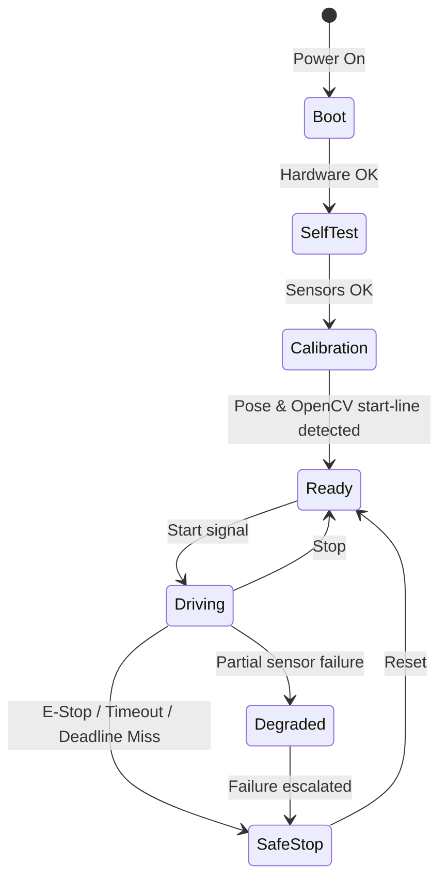
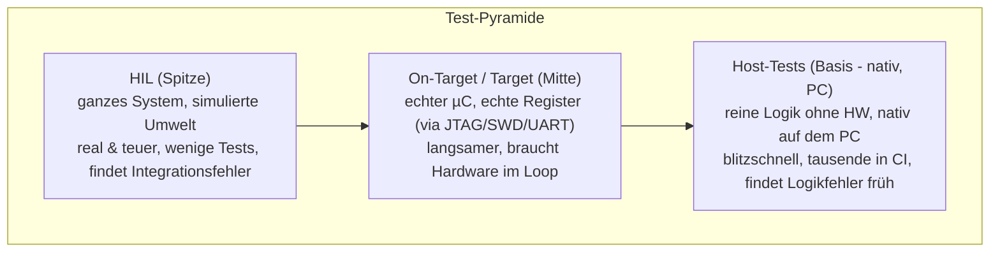

<!--

author:   WRO FE SIM Team
email:    fabian.zeiler@tu-freiberg.de
version:  1.4.0
language: de
narrator: Deutsch Female
comment:  Embedded Concept & Architektur-Spezifikation für die Sim-to-Real-Übertragung eines autonomen Rennroboters (PPO-Policy, FreeRTOS, Embedded Linux, Safety Filter).
icon:     https://upload.wikimedia.org/wikipedia/commons/d/de/Logo_TU_Bergakademie_Freiberg.svg

import:   https://raw.githubusercontent.com/LiaTemplates/mermaid_template/0.1.4/README.md

-->

[](https://liascript.github.io/course/?https://raw.githubusercontent.com/Bigfire3/wro-fe-rl-simulation/main/docs/embedded_system/embedded_concept.md#1)

# Embedded Concept -- Sim-to-Real Autonomous Racing Robot

| Parameter | Kurs- / Projektinformationen |
| --- | --- |
| **Projekt:** | `WRO Future Engineers -- Sim-to-Real Autonomous Racing Robot` |
| **Modul:** | `Softwareentwicklung für Eingebettete Systeme / RL Simulation` |
| **Hochschule:** | `Technische Universität Bergakademie Freiberg` |
| **Inhalte:** | `Embedded Architecture, Timing-Budgets, Edge-AI Deployment, Safety Supervision & Dependability` |
| **GitHub:** | [Bigfire3/wro-fe-rl-simulation](https://github.com/Bigfire3/wro-fe-rl-simulation/blob/main/docs/embedded_system/embedded_concept.md) |
| **Autoren:** | Fabian Zänker |

-----


### Kernfakten
- **Ziel:** Autonomes WRO Future Engineers Rennfahrzeug
- **Methode:** Deep Reinforcement Learning (PPO) in Webots-Simulation
- **Pipeline:** Sequenzielle 4-Stufen-Architektur (`Perception` $\rightarrow$ `Estimation` $\rightarrow$ `Planning` $\rightarrow$ `Control`)
- **Beobachtung ($\vec{o}$):** $15$-dimensionaler normalisierter Vektor ($\vec{o} \in [-1.0, 1.0]^{15}$)
- **Aktion ($\vec{a}$):** Continuous Steering & Speed Adjustments ($\Delta \delta$, $\Delta v$)
- **Modell-Export:** PyTorch $\rightarrow$ ONNX Actor Model ($18.818$ Parameter, $\approx 74\,\text{KiB}$ Float32 Gewichte)

-----

## 1. Sim-to-Real-Gap

| System-Aspekt | Webots Simulation (SiL) | Reales Embedded System |
| --- | --- | --- |
| **Sensorik** | Rauschfrei, exakt, synchrone Zeitstempel | Rauschen, Bias, Latenzen, Dropouts, asynchrone Zeitstempel |
| **Aktuatorik** | Ideale Lenkwinkel- & Drehmoment-Umsetzung | Totzonen, Spiel (Backlash), Reifenschlupf, PWM-Treiber |
| **Ressourcen** | Unbegrenzter PC (Python, NumPy, PyTorch) | Begrenzter Flash, SRAM, Rechenleistung, Energieressourcen |
| **Hauptengpass** | Keine zeitlichen Restriktionen | Perzeption & ICP-Lokalisierung (nicht die Policy selbst!) |
| **Geschwindigkeit!** | Direkt aus Physik-Engine / Supervisor | Schätzung via Encodern + IMU (Aktive Redundanz, ADC, Interrupts, Fusionsfilter) |

### 1.1 Was ich in der Simulation für die Robustheit noch tun kann
- **Domain Randomization:** Variation von Reibwerten, Massen, Trägheitsmomenten
- **Stör- & Verzögerungsmodelle:** Künstliches Sensorrauschen & Kommunikations-Latenzen
- **Sensorausfall-Szenarien:** Simulation von Sensor-Dropouts
- **Aktuator-Variabilität:** Parameterstreuung bei Motoren & Servos

-----

## 2. Echtzeit-Anforderungen & Timing-Budgets

- **Regelfrequenz:** $10\,\text{Hz}$ ($100\,\text{ms}$ Kontrollzyklus)
- **Ende-zu-Ende-Deadline:** $\le 100\,\text{ms}$ (Sensorabtastung $\rightarrow$ PWM-Ausgabe)

### 2.1 Timing-Budget-Zerlegung ($100\,\text{ms}$ Gesamtbudget)

| Phase | Zeitbudget | Hauptaufgabe |
| --- | ---: | --- |
| **1. Sensor-Sync** | $15\,\text{ms}$ | Zeitstempel-Zuordnung & Gültigkeits-Check (DMA/ISR) |
| **2. Lokalisierung (ICP)** | $40\,\text{ms}$ | Bounded Processing Time (Garantierte obere Schranke für die Ausführungszeit) |
| **3. Inferenz (ONNX)** | $15\,\text{ms}$ | Mathematisch deterministische PPO-Policy-Berechnung |
| **4. Motor- & Lenkansteuerung** | $10\,\text{ms}$ | PWM-Erzeugung & Signalübertragung (CAN/UART) |
| **5. Jitter-Reserve** | $20\,\text{ms}$ | Puffer für Interrupts, Kontextwechsel & Laufzeitschwankungen |

### 2.2 Echtzeit-Klassifikation
- **RL-Policy (Pfadplanung):** Weiche / Feste Echtzeit (Latenz verschlechtert Fahrqualität, verursacht nicht direkt Crash)
- **Sicherheitsfilter / Not-Aus:** Harte Echtzeit (Deterministische Einhaltung von Fahrzeug- & Kollisionsgrenzen)

-----

## 3. Architekturoptionen & Zielarchitektur

### 3.1 Vergleich der 3 Architektur-Varianten & Ausschlussgründe

| Variante | Plattform-Idee | Vorteile | Nachteile / Ausschlussgrund |
| --- | --- | --- | --- |
| **Variante A: Embedded Linux** | ARM-basierter Single-Board Computer (Jetson / RPi) | Python/ONNX direkt nutzbar, viel RAM für LiDAR/ICP | Kein harter Determinismus (ohne PREEMPT_RT), hoher Energiebedarf, lange Bootzeit |
| **Variante B: Mikrocontroller (MCU)** | Umsetzung auf einem Mikrocontroller (STM32 / ESP32 / ATmega) | Geringer Energiebedarf, kurze Bootzeit, direkte Hardware-Kontrolle | **ATmega328 (2 KiB SRAM):** Ungeeignet! Policy-Gewichte ($\approx 74\,\text{KiB}$) sprengen Speicher vollkommen.<br>**STM32F401 (96 KiB SRAM):** Int8-Gewichte ($\approx 19\,\text{KiB}$) passen theoretisch, aber ICP/Kamera sprengen RAM.<br>**ESP32-S3 (512 KiB SRAM):** Inferenz machbar, aber komplette Wahrnehmung (LiDAR/Pointcloud) überfordert MCU. |
| **Variante C: Heterogene Architektur (Empfehlung)** | Leistungsrechner + FreeRTOS MCU | Perfekte Aufgabentrennung (AMP), Autonomie & Sicherheit entkoppelt | Höhere Systemkomplexität & Bus-Kopplung erforderlich |

### 3.2 Heterogene Zielarchitektur & Aufgabenverteilung


| Komponente | Plattform | Hauptaufgaben | Hardware-Features |
| --- | --- | --- | --- |
| **Leistungsrechner** | Embedded Linux | Kamera/LiDAR, ICP-Lokalisierung, ONNX-Inferenz, Logging | Multicore, FPU, viel SRAM/Flash |
| **Sicherheits-Controller** | FreeRTOS MCU | Encoderauswertung, Servo/Motor-PWM, Safety Filter, Watchdog | DMA, Timer, ADC, GPIO, NVIC |
| **Bus-Kopplung** | CAN / UART | Sichere Signalübertragung mit CRC, Sequenznummer & Timeouts | Hardware-CRC, Transceiver |

-----

## 4. RTOS Task-Struktur & Hardware-Abstraktion

### 4.1 FreeRTOS Task-Zerlegung

| Task | Periode / Auslösung | Priorität | Kommunikation & Synchronisation |
| --- | --- | --- | --- |
| `Safety_Task` | Event / $1\text{--}5\,\text{ms}$ | `Highest` | Direct Interrupt / Semaphore |
| `Actuator_Task` | $5\text{--}10\,\text{ms}$ | `High` | Queue (Letzter gültiger Sollwert) |
| `Sensor_Task` | $5\text{--}10\,\text{ms}$ | `High` | DMA / Ringpuffer |
| `Autonomie_Comm_Task` | $100\,\text{ms}$ | `Medium` | Queue / Mailbox |
| `Telemetry_Task` | $500\text{--}1000\,\text{ms}$ | `Low` | Stream Buffer / UART |

### 4.2 Software-Schichtenarchitektur

```
[ Autonomie- & RL-Anwendung ]
          │
[ Plattformunabhängiges Sensor-/Aktuator-Interface ]
          │
[ Hardware Abstraction Layer (HAL) ]
          │
[ Board Support Package (BSP) & Treiber ]  ──> (GPIO, Timer, ADC, CAN, PWM)
```

### 4.3 Echtzeit-Primitiven
- **ISR & DMA:** Schnelle Datenerfassung ohne CPU-Overhead
- **Queues:** Entkoppelte Variablenübergabe zwischen Tasks
- **Mutex & PIP:** Schutz gemeinsamer Ressourcen ohne Prioritätsinversion

-----

## 5. Edge-AI Deployment & Safety Cage

### 5.1 Deployment-Pipeline
$$\text{PyTorch (PC)} \xrightarrow{\text{Export}} \text{ONNX (Float32)} \xrightarrow{\text{Quantisierung}} \text{Int8 C-Code}$$

### 5.2 Ressourcenvergleich (Modellgewichte)

| Format | Speicherbedarf Gewichte | Ziel-Laufzeitumgebung |
| --- | ---: | --- |
| **Float32 (Baseline)** | $\approx 74\,\text{KiB}$ | ONNX Runtime (Embedded Linux) |
| **Int8 (Quantisiert)** | $\approx 18\text{--}19\,\text{KiB}$ | CMSIS-NN (MCU) |

### 5.3 Safety Cage um die Policy
- RL-Policy liefert **nur Wunsch-Sollwerte** (*Requested Setpoints*)
- **Prüfkriterien des Sicherheitsfilters:**
  - Lenkwinkel- & Lenkraten-Begrenzung
  - Geschwindigkeits- & Beschleunigungs-Limits
  - Plausibilitäts-Check ($NaN$- & Ausreißer-Rejektion)
  - **Datenaktualität (Freshness):** Überprüfung, ob Sensordaten neu und nicht veraltet sind
  - **Zeitüberschreitungs-Überwachung (Timeout):** Not-Aus bei Kommunikationsabriss
  - **Not-Aus (Emergency Stop / E-Stop):** Sofortige Abschaltung im Fehlerfall

-----

## 6. Zustandsautomat für den realen Betrieb (Statechart)



### 6.1 States & Roles (Legend)
- **Boot:** Memory & driver initialization
- **SelfTest:** Hardware, sensor & voltage checks
- **Calibration:** Zero-point alignment (IMU/steering) & **initial localization via OpenCV color detection** (start-line detection & driving direction `CW`/`CCW`)
- **Ready:** System armed & ready
- **Driving:** Autonomous operation (**RL inference ONLY active here!**)
- **Degraded:** Low-speed fallback on partial failure
- **SafeStop:** E-Stop, safe braking & actuator shutdown

-----

## 7. Verifikation & Test-Pyramide

### 7.1 Test-Pyramide für eingebettete Systeme



| Stufe | Testumgebung | Eigenschaft & Ziel |
| --- | --- | --- |
| **HIL (Spitze)** | Ganzes System, simulierte Umwelt | Real & teuer, wenige Tests, findet Integrationsfehler |
| **On-Target / Target (Mitte)** | Echter $\mu\text{C}$, echte Register (JTAG/SWD/UART) | Langsamer, benötigt Hardware im Loop |
| **Host-Tests (Basis)** | Reine Logik ohne HW, nativ auf dem PC | Blitzschnell, tausende in CI, findet Logikfehler früh |

-----

## 8. Dependability & Fehlertoleranz

### 8.1 Fehler-Kaskade
$$\text{Fehlerursache (Fault)} \longrightarrow \text{Systemstörung (Error)} \longrightarrow \text{Dienstausfall (Failure)}$$

### 8.2 Schutzmaßnahmen
- **Hardware-Watchdog:** Automatischer Reset bei Software-Hängern
- **Heartbeat:** Linux-MCU Kontrollsignal-Überwachung
- **Informationelle Redundanz:** CRC32, Sequenznummern, Modell-Hashes
- **Funktionale Redundanz:** Rad-Encoder + IMU Fusionsfilter
- **Hardware-Abschaltpfad:** Physikalischer Abschaltpfad zur Deaktivierung der Motorbrücke (Fail-Safe)
