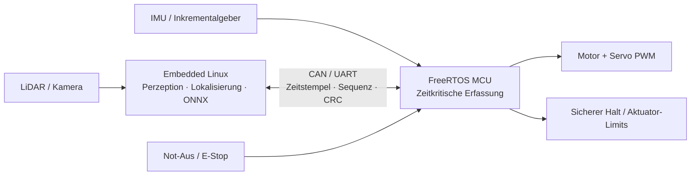
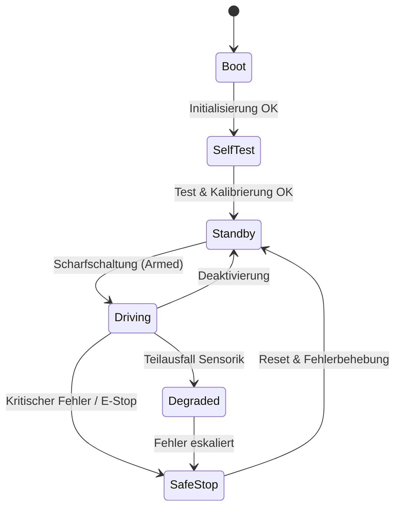

<!--

author:   WRO FE SIM Team
email:    fabian.zeiler@tu-freiberg.de
version:  1.0.0
language: de
narrator: Deutsch Female
comment:  Embedded Concept & Architektur-Spezifikation für die Sim-to-Real-Übertragung eines autonomen Rennroboters (PPO-Policy, FreeRTOS, Embedded Linux, Safety Filter).
icon:     https://upload.wikimedia.org/wikipedia/commons/d/de/Logo_TU_Bergakademie_Freiberg.svg

import:   https://raw.githubusercontent.com/LiaTemplates/mermaid_template/0.1.4/README.md

-->

[](https://liascript.github.io/course/?https://raw.githubusercontent.com/Bigfire3/wro-fe-rl-simulation/main/docs/embedded_system/embedded_concept.md#1)

# Embedded Concept -- Sim-to-Real Autonomous Racing Robot

| Parameter                | Kurs- / Projektinformationen                                                                                                                                                                                                   |
| ------------------------ | ------------------------------------------------------------------------------------------------------------------------------------------------------------------------------------------------------------------------------ |
| **Projekt:**             | `Sim-to-Real Autonomous Racing Robot`                                                                                                                                                                                          |
| **Veranstaltung / Modul:**| `Softwareentwicklung für Eingebettete Systeme / RL Simulation`                                                                                                                                                                 |
| **Hochschule:**          | `Technische Universität Bergakademie Freiberg`                                                                                                                                                                                 |
| **Inhalte:**             | `Embedded System Architecture, Timing-Budgets, Edge-AI Deployment, Safety Supervision & Dependability`                                                                                                                         |
| **Link auf GitHub:**     | [embedded_concept.md](https://github.com/Bigfire3/wro-fe-rl-simulation/blob/main/docs/embedded_system/embedded_concept.md)                                                                                                    |
| **Autoren:**             | WRO FE SIM Team                                                                                                                                                                                                                |

Dieses Dokument beschreibt das eingebettete Systemkonzept für den Transfer einer im Simulator (Webots) trainierten PPO-Policy auf eine reale, zeitkritische und sicherheitsüberwachte Hardware-Plattform.

> **Zentrale Zielvorgaben:**
> - **Regelfrequenz:** $10\,\text{Hz}$ (Kontrollzyklus: $100\,\text{ms}$)
> - **End-to-End Deadline:** $\le 100\,\text{ms}$ (Sensordatenerfassung bis Stellbefehlsgabe)
> - **Architektur:** Hybrid-Ansatz aus Embedded Linux (Autonomie/Inferenz) und FreeRTOS-MCU (Sicherheit/Aktuatorik)

-----

## 1. Zielstellung (Goal)

Das Hauptziel besteht in der zuverlässigen Übertragung (Sim-to-Real) einer mittels Reinforcement Learning (PPO) trainierten Fahrstrategie auf ein physisches Rennfahrzeug.

- **Zuverlässiger Realwelt-Einsatz:** Die trainierte PPO-Policy steuert das Fahrzeug autonom auf der Rennstrecke.
- **Einbettung in Gesamtarchitektur:** Die RL-Policy agiert als Subsystem innerhalb eines eingebetteten, zeitkritischen und sicherheitsüberwachten Regelungssystems.
- **Ziel-Regelfrequenz:** $10\,\text{Hz}$ ($100\,\text{ms}$ Zykluszeit).
- **Harte Deadline:** Die End-to-End-Latenz zwischen der Erfassung der Sensordaten und dem Anlegen der PWM-Signale an den Motoren darf $100\,\text{ms}$ nicht überschreiten.

-----

## 2. Simulations-Baseline (Simulation Baseline)

Die Referenzimplementierung basiert auf einer Webots-Simulationsumgebung im Software-in-the-Loop-Verfahren (SiL).

### 2.1 Verarbeitungs-Pipeline

```
[ Perception ]  --->  [ Estimation ]  --->  [ Planning ]  --->  [ Control ]
LiDAR / Kamera         Lokalisierung /      PPO-Policy          Ackermann-Lenkung /
IMU                    ICP / Map            (RL Agent)          Motor & Servo PWM
```

1. **Perzeption:** LiDAR, IMU, Farbkamera.
2. **Zustandsschätzung:** Lokalisierung, ICP (Iterative Closest Point), Hinderniskartierung.
3. **Pfadplanung / Agent:** PPO-Policy (Neuronales Netz).
4. **Regelung:** Ackermann-Kinematik, Ansteuerung von Antriebsmotor und Lenkservo.

### 2.2 Modell-Spezifikation

- **Beobachtungsraum:** Normalisierter 15-dimensionaler Vektor ($\vec{o} \in [-1.0, 1.0]^{15}$), der Eigenbewegung, Fahrbahnränder und Hindernispositionen repräsentiert.
- **Aktionsraum:** Zwei kontinuierliche Stellgrößen:
  - Lenkwinkeländerung ($\Delta \delta$)
  - Geschwindigkeitsänderung ($\Delta v$)
- **Modell-Format:** PyTorch-Training mit anschließendem Export als ONNX-Akteur-Netzwerk.
- **Modell-Footprint:** 18.818 Parameter (entspricht ca. $74\,\text{KiB}$ Float32-Gewichten).

-----

## 3. Sim-to-Real Herausforderungen (Sim-to-Real Challenges)

Der Transfer aus der Simulation auf die physische Hardware bringt verschiedene Realwelt-Effekte mit sich, die adressiert werden müssen.

### 3.1 Physikalische & Technische Effekte

- **Geschwindigkeitsschätzung:** Ermittlung der realen Ist-Geschwindigkeit aus Rad-Inkrementalgebern, IMU-Fusion und Zustandsschätzung.
- **Störungen der Sensorik:** Rauschen, Drift/Bias, Quantisierungsfehler, Latenzen, Paketverluste und unvollständige Zeitstempel-Synchronisation.
- **Aktuatorik-Dynamik:** Totzonen, Stellgrößensättigung, mechanisches Spiel (Backlash), Reifenschlupf und Stellverzögerungen.
- **Ressourcenbeschränkungen:** Limitierter Flash- und SRAM-Speicher, begrenzte Rechenleistung, Energie- und Thermobudget auf der Zielhardware.
- **Flaschenhälse:** Bildverarbeitung und Lokalisierung stellen die primären Ressourcen-Engpässe dar.

### 3.2 Maßnahmen im RL-Training (Training-Side Mitigation)

> Um die Robustheit gegenüber Modellabweichungen zu erhöhen, werden während des Trainings folgende Techniken eingesetzt:

- **Domain Randomization:** Variation von Reibwerten, Massen, Trägheitsmomenten und Fahrbahngeometrien.
- **Stör- & Verzögerungsmodelle:** Injektion von künstlichem Sensorrauschen und Kommunikations-Latenzen.
- **Sensorausfall-Szenarien:** Simulation temporärer Sensor-Dropouts.
- **Aktuator-Variabilität:** Schwankende Ansprechzeiten und Parameterschwankungen der Motoren/Servos.

-----

## 4. Zielarchitektur (Target Architecture)

Die Systemarchitektur verteilt die Aufgaben auf zwei dedizierte Recheneinheiten, um rechenintensive KI-Aufgaben von deterministischen Sicherheits- und Steuerungsaufgaben zu trennen.



### 4.1 Aufgabenverteilung

#### Embedded Linux (z. B. Jetson Orin / Raspberry Pi)
- Verarbeitung von Kamera- und LiDAR-Daten.
- Ausführung von Lokalisierung, Kartierung und Extraktion des 15D-Beobachtungsvektors.
- ONNX-Runtime-Inferenz des PPO-Netzwerks.
- System-Logging, Telemetrie und Diagnose-Schnittstellen.

#### FreeRTOS Mikrocontroller (z. B. STM32 / Cortex-M4)
- High-Speed Datenerfassung von Inkrementalgebern und IMU.
- Erzeugung der PWM-Signale für Fahrantrieb und Lenkservo.
- Überwachung von Betriebsspannung und Systemströmen.
- Ausführung des Hardware-Watchdogs, der Not-Aus-Logik und des Sicherheitsfilters.

-----

## 5. Timing & Software-Design

### 5.1 Zeitbudget des 10 Hz Regelkreises ($100\,\text{ms}$)

| Aktivität im Regelkreis | Budget | Design-Fokus |
| --- | ---: | --- |
| **Sensor-Synchronisation** | $15\,\text{ms}$ | Zeitstempel-Zuordnung & Gültigkeitsprüfung |
| **Lokalisierung & Kartierung** | $40\,\text{ms}$ | Deterministisch begrenzte Ausführungszeit |
| **Beobachtung & RL-Inferenz** | $15\,\text{ms}$ | Ausführung der ONNX-Inferenz innerhalb der Deadline |
| **Aktuierung & Kommunikation** | $10\,\text{ms}$ | Sichere Befehlsübermittlung (CAN / UART) |
| **Jitter-Reserve** | $20\,\text{ms}$ | Puffer für Interrupts & Timing-Schwankungen |

### 5.2 RTOS Task-Priorisierung (FreeRTOS)

| RTOS Task-Gruppe | Priorität | Timing-Rolle / Funktion |
| --- | --- | --- |
| **Emergency Stop & Safety** | Höchste (`Highest`) | Unmittelbare Überführung in den sicheren Zustand bei Fehlern |
| **Motor, Servo, IMU, Encoder** | Hoch (`High`) | Deterministische Sensorabtastung und PWM-Aktuierung |
| **Perzeption, Lokalisierung, RL** | Mittel (`Medium`) | Ausführung des autonomen Regelkreises und Modell-Inferenz |
| **Logging & Telemetrie** | Niedrig (`Low`) | Nicht-kritische Datenaufzeichnung und Diagnose-Schnittstelle |

### 5.3 Software-Architektur & Profiling

- **Erforderliche Profiling-Metriken:**
  - Worst-Case Execution Time (WCET) & durchschnittliche Ausführungszeit.
  - Jitter-Messung, Kommunikations-Latenzen und Überwachung von Deadline-Verletzungen.
- **Schichtenarchitektur (Abstraktion):**
  1. Autonomie-Anwendung (PPO Policy / Perzeption)
  2. Hardwareunabhängige Sensor- & Aktuatorschnittstellen
  3. Hardware Abstraction Layer (HAL)
  4. Board Support Package (BSP) & Treiber
- **Echtzeit-Primitiven:** Nutzung von DMA (Direct Memory Access), kurzen ISRs (Interrupt Service Routines), Message Queues, Ringpuffern und Semaphoren.
- **Super-Loop Policy:** Ein vereinfachter Super-Loop wird erst nach messtechnisch nachgewiesener Einhaltung aller Deadlines als Alternative in Betracht gezogen.

-----

## 6. Edge-AI Deployment

### 6.1 Modell-Konvertierung & Optimierung

- **Normalisierung:** Fest eingefrorener Eingangsnormalisierungsvektor und Referenz-Transformationen.
- **Validierung:** Abgleich der Ausgangsvektoren zwischen PyTorch-Referenz und ONNX-Modell.
- **Embedded Linux Baseline:** Ausführung im Float32-Präzisionsmodus mittels ONNX Runtime.
- **MCU Feasibility Path (Mikrocontroller-Option):**
  - C/C++ Inferenz-Engine (z.B. TFLite Micro / CMSIS-NN / microTVM).
  - Post-Training-Quantisierung auf **Int8**.
  - Speicherbedarf sinkt auf ca. $18\text{--}19\,\text{KiB}$ Int8-Gewichte (exklusive Runtime- & Puffer-Overhead).

### 6.2 Evaluierungsmetriken für Deployment

- Flash- und SRAM-Speicherbedarf.
- Inferenz-Latenz und Ausführungs-Jitter.
- Numerische Abweichungen gegenüber der PyTorch-Referenz sowie Auswirkung auf das Fahrverhalten.

-----

## 7. Sicherheit & Betriebsmodi (Safety and Operation)

### 7.1 Deterministischer Sicherheitsfilter (Safety Filter)

> **Grundprinzip:** Die Befehle der RL-Policy werden vom System niemals direkt an die Aktuatoren durchgereicht, sondern dienen ausschließlich als **Wunsch-Sollwerte** (Requested Setpoints).

 Der nachgelagerte Sicherheitsfilter prüft und beschränkt die Signale deterministisch:

1. **Grenzwertüberwachung:** Beschränkung von Lenkwinkel, Lenkwinkelgeschwindigkeit, Fahrgeschwindigkeit und Beschleunigung.
2. **Datenfrische:** Überprüfung der Aktualität (Freshness) und Validität aller eingehenden Sensordaten.
3. **Timeout-Überwachung:** Automatische Abschaltung bei Ausbleiben von Steuerbefehlen oder Kommunikationsababriss.
4. **Plausibilitätsprüfung:** Rejektion von ungültigen Werten (z. B. `NaN` oder Ausreißer außerhalb des Definitionsbereichs).
5. **E-Stop & Safe Stop:** Erzwungene Überführung in den sicheren Halt bei Verletzung der Sicherheitsgrenzen.

### 7.2 Betriebsmodi (State Machine)



- **Boot:** Systemstart, Speicherprüfungen und Hardware-Initialisierung.
- **Self-Test & Calibration:** Überprüfung der Sensorik/Aktuierung und Nullpunkt-Kalibrierung.
- **Standby & Armed:** Betriebsbereitschaft und Scharfschaltung des Fahrzeugs.
- **Driving:** Autonomer Fahrbetrieb (**RL-Inferenz ist nur in diesem Zustand aktiv**).
- **Degraded Mode:** Notbetrieb mit reduzierter Geschwindigkeit bei Teilfehlern.
- **Safe Stop & Fault:** Sicheres Anhalten des Fahrzeugs bei kritischen Systemfehlern.

-----

## 8. Verifikation & Zuverlässigkeit (Verification and Dependability)

### 8.1 Teststufen

1. **Unit Tests:** Überprüfung von Koordinatentransformationen, Ackermann-Kinematik, Normalisierungsfunktionen, Clipping und Inferenz-Referenzen.
2. **MiL / SiL (Model- / Software-in-the-Loop):** Simulation unter Einfluss von Sensorrauschen, Totzeiten, Parametervariations-Tests und gezielter Fehlerinjektion (Fault Injection).
3. **HiL (Hardware-in-the-Loop):** Verifikation des Firmware-Timings, Jitter, Speicherverbrauchs, Kommunikationsprotokolls und Watchdog-Verhaltens am Prüfstand.
4. **Inkrementelle Fahrzeugtests:**
   - Aufgebocktes Fahrzeug (Raised Wheels Test)
   - Langsame Geradeausfahrt
   - Kurvenfahrt & Hindernisumfahrung
   - Fehlerinjektion auf der Teststrecke

### 8.2 Zuverlässigkeitsmechanismen (Dependability)

- **Hardware-Watchdog:** Automatischer Controller-Reset bei Software-Hängern.
- **Linux-MCU Heartbeat:** Gegenseitige Überwachung der Kommunikationsverbindung.
- **Redundanz:** Abgleich zwischen Inkrementalgebern und IMU-Daten zur Plausibilisierung.
- **Datenintegrität:** CRC-Prüfsummen für alle Nachrichten, Modell-Hashes und Konfigurations-Checklisten.
- **Abschaltpfad:** Unabhängiger, von der MCU kontrollierter physischer Abschaltpfad für die Aktuatoren.

-----

## 9. Meilensteine & Delivery (Delivery Milestones)

- [x] **M1:** Hardwareunabhängige Schnittstellenspezifikation.
- [ ] **M2:** Prototyp der Linux-Autonomieanwendung und MCU-Sicherheitssteuerung.
- [ ] **M3:** Deterministisches Kommunikationsprotokoll (CAN / UART).
- [ ] **M4:** Timing-, Speicher- und Safety-Filter-Validierung.
- [ ] **M5:** ONNX-Referenz-Testsuite und Quantisierungs-Assessment.
- [ ] **M6:** HiL-Prüfstandsaufbau und inkrementelle Teststrecken-Validierung.
- [ ] **M7:** CI-Pipeline für automatische Tests, statische Code-Analyse, Builds, Modell-Kompatibilität und Regressionsszenarien.
