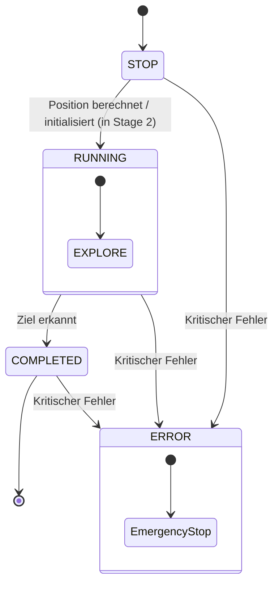

# Spezifikation der Zustandsmaschine (State Machine)

## A. Zweck
Der Planning-Layer ist für übergeordnete Verhaltensentscheidungen und die Trajektorienberechnung verantwortlich. Er kapselt die Zustandslogik des Roboters und trennt den globalen System-Lebenszyklus von den fahrbezogenen Verhaltensmustern.

---

## B. Hierarchie
SYSTEM STATE MACHINE
├── STOP
├── RUNNING
├── COMPLETED
└── ERROR

---

## C. Unter-State-Machine
RUNNING SUBSTATE MACHINE
└── EXPLORE

---

## D. Zustandsübergänge & Diagramme

### Hierarchisches Zustandsdiagramm (HSM)

### Zustands-Übergangstabelle

| Ausgangszustand | Folgezustand | Bedingung / Trigger | Beschreibung |
| :--- | :--- | :--- | :--- |
| `STOP` | `RUNNING` (sub: `EXPLORE`) | Position berechnet / initialisiert | Übergang erfolgt, sobald Stage 2 (Estimation) die initiale Pose bestimmt und die Fahrtrichtung (CW/CCW) festgelegt hat. |
| `RUNNING` (sub: `EXPLORE`) | `COMPLETED` | Ziel erkannt (nach 3 Runden) | Der Roboter hat die 3 vorgeschriebenen Runden absolviert und steht sicher im Zielbereich. |
| **JEDER Zustand** | `ERROR` | Kritischer Fehler (z. B. Sensorverlust) | Sofortiger Übergang bei Signalverlust von LiDAR, IMU oder kritischen Systemkomponenten. |

---

## E. Zustandsbeschreibung

### STATE: STOP

**Purpose:**
Warten auf den Abschluss der initialen Positionsbestimmung (Kalibrierung) in Stage 2 (Estimation), um eine sichere Initialisierung des Gesamtsystems zu gewährleisten.

**Inputs:**
- LiDAR-Datenstrom (`lidar_ranges`)
- IMU-Daten
- Flag `initial_pose_found` aus Stage 2

**Outputs:**
- Stillstandsbefehl an die Regelung (Motorgeschwindigkeit = 0.0, Lenkwinkel = 0.0)

**Exit Conditions:**
- Initiale Pose erfolgreich bestimmt (Wechsel zu `RUNNING` mit Sub-State `EXPLORE`)
- Kritischer Sensorverlust oder Sensor-Timeout (Wechsel zu `ERROR`)

---

### STATE: RUNNING

**Purpose:**
Aktiver Betriebsmodus auf der Strecke. Kapselt und führt die Sub-State Machine für die fahrbezogenen Verhaltensmuster aus.

**Inputs:**
- Kontinuierliche Sensordaten (LiDAR, IMU, Kamera)
- Geschätzte Roboterpose `(x_real, y_real, yaw_real)`
- Solltrajektorie des aktiven Sub-States

**Outputs:**
- Soll-Lenkwinkel und Soll-Geschwindigkeit für die Regelung (Stage 4)
- Aktualisiertes Belegungsgitter (Occupancy Grid)

**Exit Conditions:**
- Ziellinie erkannt und 3 Runden absolviert (Wechsel zu `COMPLETED`)
- Kritischer Sensorverlust oder Hardware-Fehler (Wechsel zu `ERROR`)

---

### STATE: COMPLETED

**Purpose:**
Kontrolliertes Stoppen des Roboters nach erfolgreichem Erreichen des Zielbereichs oder Abschluss der geforderten 3 Runden.

**Inputs:**
- Signal "Mission beendet"

**Outputs:**
- Bremsbefehl an die Aktuatoren (kontrollierte Verzögerung bis zum Stillstand)

**Exit Conditions:**
- Keine (Endzustand, Fahrzeug verbleibt im sicheren Stillstand)
- Kritischer Fehler (Wechsel zu `ERROR`)

---

### STATE: ERROR

**Purpose:**
Notaus-Zustand bei schwerwiegenden Fehlern, um Beschädigungen des Roboters oder der Umgebung zu verhindern.

**Inputs:**
- Fehlersignal (z. B. LiDAR-Timeout, Ausfall der IMU oder unplausible Lokalisierungsdaten)

**Outputs:**
- Unverzügliche Notbremsung (Motorgeschwindigkeit = 0.0, Lenkwinkel = 0.0)
- Fehlermeldung und Diagnoseausgabe

**Exit Conditions:**
- Keine (System verbleibt bis zum manuellen Reset/Neustart im Fehlerzustand)

---

### STATE: EXPLORE (Sub-State von RUNNING)

**Purpose:**
Erkundung der Rennstrecke zur Hinderniserkennung und automatischen Kartografierung des Streckenlayouts (Belegungsgitter).

**Inputs:**
- Aktuelle Pose `(x_real, y_real, yaw_real)`
- Lokales Belegungsgitter
- LiDAR-Distanzen

**Outputs:**
- Erkundungs-Soll-Trajektorie (Geschwindigkeits- und Lenkvorgaben für Wandfolgemodus und Hindernisumfahrung)
- Aktualisierte globale Karte

**Exit Conditions:**
- Ziel/Ende der Mission nach 3 Runden erkannt (Wechsel zu `COMPLETED`)
- Kritischer Fehler (Wechsel zu `ERROR`)
