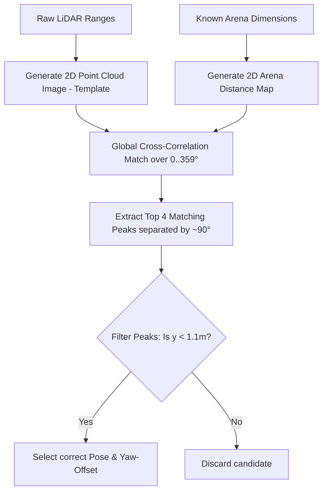

# Detaillierte Ausschlussanalyse alternativer Ansätze zur Initial-Yaw-Bestimmung

Dieses Dokument analysiert und begründet systematisch den Ausschluss verschiedener Standardalgorithmen zur Bestimmung des initialen Ausrichtungswinkels (Yaw-Offset von 0° bis 360°) des Roboters beim Start in der WRO 2026 Future Engineers Arena. 

Es zeigt auf, warum klassische Methoden unter den spezifischen Randbedingungen der WRO-Regeln scheitern, und stellt dem den ausgewählten Gewinner-Ansatz (**Globales Template Matching mit Süden-Verankerung**) gegenüber.

---

## 1. Problemdefinition & WRO-Randbedingungen

Um die Schwachstellen alternativer Ansätze zu verstehen, müssen die geometrischen und physikalischen Rahmenbedingungen der WRO-Arena betrachtet werden:

* **Symmetrie:** Die Arena ist quadratisch ($3{,}0\,\text{m} \times 3{,}0\,\text{m}$ Außenwände, $1{,}0\,\text{m} \times 1{,}0\,\text{m}$ Innenbox im Zentrum). Dies führt zu einer **4-fachen Rotationssymmetrie**. Lokale Scans bei $0^\circ, 90^\circ, 180^\circ$ und $270^\circ$ sehen geometrisch nahezu identisch aus.
* **Startkorridor (Süden):** Der Roboter startet immer im südlichen Korridor (unter dem WRO-Logo), was bedeutet, dass seine anfängliche Position im globalen Koordinatensystem bei $y < 1{,}1\,\text{m}$ liegt. Seine Ausrichtung ($\theta$) beim Start ist jedoch beliebig (z. B. geradeaus nach Osten/CCW bei $\approx 90^\circ$, nach Westen/CW bei $\approx 270^\circ$ oder schräg aufgestellt wie $105^\circ$ bzw. $359^\circ$).
* **Hindernisse (Pillars):** Auf dem Track befinden sich vier quaderförmige Säulen ($45\,\text{mm} \times 45\,\text{mm} \times 100\,\text{mm}$), die Wände verdecken und LiDAR-Strahlen unterbrechen.
* **Keine harten Indizes:** Ein Zugriff auf feste Indizes im LiDAR-Datenarray (z. B. `lidar[0]` für "vorne") ist unzulässig, da sich durch die freie Ausrichtung des Roboters beim Start die Zuordnung der Indizes zu den Himmelsrichtungen komplett verschiebt.

---

## 2. Analyse der ausgeschlossenen Ansätze

### 2.1. Hauptkomponentenanalyse (PCA - Principal Component Analysis)

#### Funktionsweise
Die LiDAR-Punkte werden in kartesische Koordinaten ($X, Y$) umgerechnet. Über die Kovarianzmatrix der Punktwolke werden die Eigenvektoren bestimmt. Der erste Eigenvektor (mit dem größten Eigenwert) zeigt die Richtung der größten Varianz der Punkte und soll so die Orientierung der dominanten Wände liefern.

```
       ▲ Y (Nord)
       │      ┌─────────────────────┐
       │      │       ▲             │
       │      │       │ Eigenvektor │
       │      │  ◄────┼────►        │
       │      │       │             │
       │      │       ▼             │
       │      └─────────────────────┘
 (0,0) └──────────────────────────────► X (Ost)
```

#### Warum PCA für WRO scheitert
1. **Isotropie bei Quadraten (Gleiche Eigenwerte):** Da die WRO-Arena ein perfektes Quadrat ist, verteilen sich die LiDAR-Punkte bei einem Rundum-Scan gleichmäßig in alle Richtungen. Die Kovarianzmatrix besitzt zwei nahezu identische Eigenwerte. In einem solchen isotropen Zustand ist die Richtung der Eigenvektoren mathematisch extrem instabil. Minimales Rauschen, ein einzelnes Hindernis oder die asymmetrische Startposition des Roboters führt dazu, dass die berechneten Achsen unvorhersehbar um $90^\circ$ springen.
2. **Abhängigkeit von der Position:** Befindet sich der Roboter außerhalb des Zentrums (z. B. im Startkorridor bei $y \approx 0{,}45\,\text{m}$), ist die Punktwolke stark asymmetrisch verschoben. Die Hauptachse der Punktwolke entspricht dann nicht mehr der Wandorientierung, sondern ist diagonal verzerrt.
3. **180°-Mehrdeutigkeit:** PCA liefert prinzipbedingt nur ungerichtete Achsen. Sie kann nicht zwischen einer Ausrichtung nach Osten ($90^\circ$) und Westen ($270^\circ$) unterscheiden.

> [!CAUTION]
> **Fazit:** PCA liefert in quadratischen Umgebungen mit variabler Startposition absolut zufällige Richtungsvektoren und ist für dieses Problem unbrauchbar.

---

### 2.2. Kanten-Winkel-Histogramm (Edge-Angle Histogram)

#### Funktionsweise
Es werden die Differenzenvektoren zwischen aufeinanderfolgenden LiDAR-Punkten berechnet, um lokale Wandtangenten zu schätzen. Der Winkel dieser Tangenten relativ zum Roboter wird berechnet und modulo $90^\circ$ in ein Histogramm eingetragen. Der ausgeprägteste Peak repräsentiert die Ausrichtung des globalen Wandgitters relativ zum Roboter.

#### Warum das Kanten-Winkel-Histogramm scheitert
1. **Verlust der globalen Richtung (Modulo 90°):** Das Histogramm liefert konstruktionsbedingt nur den Winkel zur *nächstgelegenen* Wand (Winkel im Intervall $[0^\circ, 90^\circ)$). Es kann nicht auflösen, ob der Roboter nach Norden ($0^\circ$), Osten ($90^\circ$), Süden ($180^\circ$) oder Westen ($270^\circ$) blickt.
2. **Fragile Post-Heuristiken:** Um die verbleibende 4-fach-Mehrdeutigkeit aufzulösen, müsste man Entfernungen in bestimmte Richtungen prüfen. Da der Roboter jedoch einen beliebigen Startwinkel (z. B. $359^\circ$) haben kann, kann man nicht einfach feste Array-Indizes prüfen (wie `lidar_ranges[0]` für Norden). Die Suche nach der Innenwand verschiebt sich dynamisch im Array und wird durch Hindernisse (Pillars) leicht gestört, was zu Fehlklassifikationen führt.

> [!WARNING]
> **Fazit:** Die mathematische Reduktion auf einen modulo-$90^\circ$-Winkel erzwingt komplexe, fehleranfällige Heuristiken zur Richtungserkennung, die bei verrauschten Daten oder Hindernissen versagen.

---

### 2.3. Standard-ICP (Iterative Closest Point)

#### Funktionsweise
ICP rotiert und verschiebt die LiDAR-Punktewolke iterativ, um den quadratischen Abstand zu einem bekannten geometrischen Referenzmodell (den Linien der Wände) zu minimieren.

```
       Modellwand
       ───────────
          x   x    <-- LiDAR-Punkte (Startposition)
         /   /     
        ▼   ▼      <-- Iterative Verschiebung/Rotation
       ───────────
       o   o   o   <-- Perfekte Ausrichtung (Ziel)
```

#### Warum Standard-ICP scheitert
1. **Gefangenschaft in lokalen Minima:** ICP ist ein lokales Optimierungsverfahren (Gradientenabstieg). Es konvergiert nur dann zur korrekten globalen Pose, wenn die initiale Schätzung bereits sehr nah am wahren Wert liegt. Startet der Roboter mit einem großen Offset (z. B. schräg aufgestellt bei $45^\circ$ oder extrem bei $359^\circ$), rastet die Punktwolke an der falschen Wand ein (ein lokales Minimum bei $90^\circ, 180^\circ$ oder $270^\circ$ Versatz) und findet niemals die reale Pose.
2. **Keine globale Suche:** ICP sucht nicht systematisch den gesamten Suchraum von $0^\circ$ bis $360^\circ$ ab. Ein "Multi-Start-ICP" (Aufrufen von ICP mit verschiedenen Startwinkeln) ist rechenintensiv und bei symmetrischen Umgebungen dennoch anfällig für falsche Konvergenz.

> [!IMPORTANT]
> **Fazit:** Aufgrund des beliebig großen initialen Winkelfehlers beim Start wird Standard-ICP mit hoher Wahrscheinlichkeit in einem der vier symmetrischen lokalen Minima gefangen.

---

### 2.4. RANSAC-Linien-Fitting & Eckenerkennung

#### Funktionsweise
Mittels des RANSAC-Algorithmus (Random Sample Consensus) werden gerade Liniensegmente aus den LiDAR-Punkten extrahiert. Die Schnittpunkte dieser Linien ergeben die Ecken der Arena. Aus der Ausrichtung der Linien und der relativen Position der Ecken wird die Lage des Roboters rekonstruiert.

#### Warum RANSAC & Eckenerkennung scheitern
1. **Selbstverdeckung & Abschattung:** Der Roboteraufbau selbst oder sehr nahe Wände können den Sichtbereich des LiDAR-Sensors einschränken. Wenn nicht genügend Wände oder Ecken im direkten Sichtfeld liegen, fehlen die geometrischen Randbedingungen für eine eindeutige Berechnung.
2. **Fragmentierung durch Hindernisse:** Die auf dem Track verteilten Hindernisse (Pillars, Magenta-Wände der Parkbucht) brechen die Linien der Wände auf. RANSAC läuft Gefahr, Linien fälschlicherweise durch Hindernisse zu legen oder die echten Wände aufgrund von Lücken nicht als zusammenhängende Linien zu erkennen.
3. **Komplexität bei der Zuordnung:** Selbst wenn Linien gefunden werden, müssen diese eindeutig der "Innenwand" oder "Außenwand" zugeordnet werden. Diese geometrische Zuordnung ist hochgradig fehleranfällig, wenn Wände durch Hindernisse verkürzt dargestellt werden.

---

## 3. Der Gewinner-Ansatz: Globales Template Matching mit Süden-Verankerung

Im Vergleich zu den klassischen Ansätzen löst das **2D-Template Matching kombiniert mit einer physikalischen Süden-Filterung** alle oben genannten Probleme ohne fragile Heuristiken:

### Das Funktionsprinzip



1. **Globaler Suchraum:** Der Algorithmus rotiert das LiDAR-Punkt-Template systematisch in Schritten (z. B. $1^\circ$) über den vollen Kreis ($0^\circ$ bis $359^\circ$) und berechnet jeweils die beste Übereinstimmung mit der Arena-Karte. Dies verhindert lokale Minima vollständig.
2. **Holistische Auswertung:** Jeder einzelne LiDAR-Punkt trägt zum Matching-Score bei. Rauschen, Lücken oder vereinzelte Hindernisse (wie die Pillars) fallen statistisch kaum ins Gewicht, da die große Mehrheit der Punkte auf den echten Wänden liegt.
3. **Eindeutige Auflösung der Symmetrie:** Die 4-fache Symmetrie der Arena erzeugt vier äquivalente Maxima im Matching-Score (jeweils um $90^\circ$ versetzt). Da wir physikalisch wissen, dass der Roboter im südlichen Korridor startet, filtern wir die Ergebnisse nach der Y-Koordinate: **Nur der Kandidat mit $y_{\text{real}} < 1{,}1\,\text{m}$ wird ausgewählt.** Dies bestimmt die Orientierung absolut fehlerfrei und ohne harte LiDAR-Indexabfragen.

---

## 4. Direkter Vergleich der Ansätze

| Kriterium | PCA | Kanten-Histogramm | Standard-ICP | RANSAC / Ecken | Template Matching + Süden |
| :--- | :---: | :---: | :---: | :---: | :---: |
| **Robust gegen Rauschen & Lücken** | ❌ Schlecht | ⚠️ Mittel | ⚠️ Mittel | ❌ Schlecht |  **Exzellent** |
| **Robust gegen Hindernisse (Pillars)** | ❌ Schlecht | ❌ Schlecht | ⚠️ Mittel | ❌ Schlecht |  **Exzellent** |
| **Auflösung der 4-fach-Symmetrie** | ❌ Unmöglich | ❌ Nur modulo 90° | ❌ Lokales Minimum | ⚠️ Nur über Ecken |  **Sicher (durch Süden-Filter)** |
| **Keine harten LiDAR-Index-Zugriffe** |  Ja | ❌ Nein (fragile Heuristik) |  Ja |  Ja |  **Ja** |
| **Unempfindlich gegen schräge Startwinkel** | ❌ Schlecht |  Ja (nur mod 90) | ❌ Schlecht | ⚠️ Mittel |  **Exzellent (0–359° Suche)** |
| **Vermeidung von Schwellenwerten (Wandlängen)**|  Ja | ❌ Nein |  Ja | ❌ Nein |  **Ja** |
